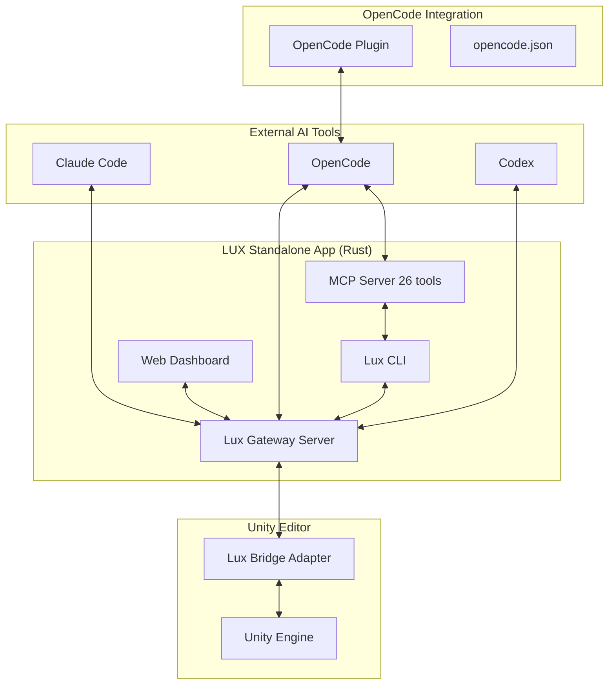

# LUX — Standalone Unity Editor AI Automation Toolkit

**LUX** = **L**inalab **U**nity **X** — 로컬 퍼스트 유니티 에디터 AI 자동화 툴킷.

LUX는 AI 코딩 도구(Claude Code, OpenAI Codex, OpenCode)와 Unity Editor를 연결하는 **독립형(Standalone)** 자동화 도구입니다. 기존의 유니티 패키지 방식에서 벗어나, 별도의 애플리케이션으로 동작하며 유니티 프로젝트에 브릿지를 설치하여 에디터를 제어합니다.

> **"Local-first"** — 모든 기능은 `localhost`에서 작동합니다. 보안과 성능을 위해 원격 스트리밍이나 외부 클라우드 의존성을 최소화합니다.

## 핵심 기능

### 🤖 AI 코딩 도구 연동
- **멀티 AI 터미널** — Claude Code, OpenAI Codex, OpenCode를 웹 대시보드에서 전환하며 사용
- **스킬 디스패치** — compile, test, screenshot, logs, playmode 등을 어떤 AI 도구에서든 일관되게 호출
- **도구 실행 API** — `/api/tools/execute` + WebSocket 이벤트 브로드캐스팅
- **AI 이벤트 로깅** — 구조화된 JSONL 이벤트 로그 (22+ redaction 패턴)

### 🔌 OpenCode 통합
- **MCP 서버** — `lux mcp serve`로 OpenCode에 26개 도구 제공 (lux_init, lux_status, lux_goals, compile, test 등)
- **자동 등록** — `lux init` 실행 시 대상 프로젝트의 `opencode.json`에 MCP 서버 자동 등록
- **OpenCode 플러그인** — 세션 상태 토스트, Lux 도구 실행 알림, 컨팩션 컨텍스트 주입
- **`.lux/` SSoT** — 모든 런타임 상태를 `.lux/` 디렉토리에서 단일 소스로 관리

### 🔧 Unity Editor 통합 (Bridge)
- **AI Bridge TCP 서버** — 외부 터미널/클라이언트 프로토콜 핸들러
- **자동화 가드레일** — 명령어 블랙리스트, 감사 로그, 승인 상태
- **프로젝트 컨텍스트 수집** — 에디터 상태, 컴파일 오류, 테스트 결과 등을 AI 도구에 제공

### 🖥️ Rust 게이트웨이 & CLI
- **웹 서버** — Axum HTTP/WebSocket 게이트웨이 (React SPA + REST API)
- **CLI 명령어** — serve, init, unity, skill, ai-log, compile, session, mcp, config, screenshot, bridge
- **브릿지 설치** — `lux bridge install` 명령어로 유니티 프로젝트에 자동 설치
- **자동 업데이트** — git commit SHA 기반 변경 감지, 백그라운드 자동 업데이트
- **스킬 시스템** — 번들 코어 스킬 + 설치 가능한 외부 스킬 (`lux skill install/remove/update`)

### 📊 로컬 웹 대시보드
- **Compile Panel** — 배치 컴파일 실행 및 결과 확인
- **Test Panel** — EditMode/PlayMode 테스트 실행 및 결과 보기
- **Log Panel** — AI 이벤트 로그 조회 (필터링 지원)
- **Skill Panel** — 설치된 스킬 관리
- **Project Panel** — Unity 프로젝트 상태 및 컨텍스트

## 아키텍처



## 로드맵

| Phase | 이름 | 상태 | 설명 |
|-------|------|------|------|
| **A** | Core Gateway & CLI | ✅ 완료 | Rust Gateway, CLI, Bridge Adapter 통합 |
| **B** | AI Event System | ✅ 완료 | 이벤트 로깅, JSONL, Redaction, Sessions API |
| **C** | Local Web Dashboard | ✅ 완료 | React SPA 로컬 대시보드 (compile/test/log/skill) |
| **D** | Multi-AI Skill Dispatch | ✅ 완료 | Claude/Codex/OpenCode 통합 스킬 디스패치 |
| **E** | OpenCode Native Integration | ✅ 완료 | MCP 서버, OpenCode 플러그인, 자동 등록 |

### Out of Scope
- ❌ WebRTC / RTC Terminal / 원격 비디오 스트리밍
- ❌ 브라우저에서 Unity Editor 원격 제어
- ❌ iOS companion app / PWA
- ❌ Windows/Linux 에디터 지원 (macOS-first)

## 빠른 시작

### 사전 요구사항
- **Unity 6000.0+** (Unity 6.x)
- **Rust toolchain** (`rustup` + `cargo`)
- **Node.js 18+** (웹 UI 개발 시)
- **macOS** (macOS 전용 기능을 포함하고 있습니다)

### 설치

```bash
# 1. LUX CLI 설치
cargo install --path gateway

# 2. 유니티 프로젝트에 브릿지 설치
lux bridge install --project-path /path/to/your/unity-project
```

### 초기화 및 OpenCode 연동

```bash
# 1. 프로젝트 디렉토리에서 Lux 초기화
cd /path/to/your/project
lux init

# 2. 자동으로 수행되는 작업:
#    - .lux/ 디렉토리 생성 (프로젝트 상태 SSoT)
#    - opencode.json에 MCP 서버 등록
#    - .opencode/plugins/에 Lux 플러그인 설치
#    - OpenCode에서 lux_* 도구 사용 가능

# 3. 별도 등록도 가능
lux mcp register --project-path /path/to/project
```

### 실행

```bash
# 게이트웨이 서버 시작
lux serve

# 유니티 프로젝트 상태 확인
lux unity status

# MCP 서버 모드 (OpenCode 연동)
lux mcp serve
```

## 프로젝트 구조

```
Lux/
├── gateway/               # Rust CLI + Axum 서버
│   ├── src/
│   │   ├── main.rs        # CLI 진입점, 서브커맨드 디스패치
│   │   ├── server.rs      # Axum HTTP/WS 라우트
│   │   ├── mcp.rs          # MCP 도구 서버 (26개 도구)
│   │   ├── auto_update.rs  # 자동 업데이트
│   │   └── ...
│   ├── ui-src/             # React 대시보드 SPA
│   └── tests/             # 통합 테스트
├── bridge/                # Unity 브릿지 어댑터 (C#)
├── mcp-helper/             # Node.js MCP 헬퍼
├── plugins/
│   └── opencode/           # OpenCode 플러그인
│       └── lux-plugin.ts   # 세션 상태 토스트, 컨텍스트 주입
├── Skills/                 # 코어 AI 스킬 매니페스트
├── scripts/                # 유틸리티 스크립트
└── seeds/                  # YAML 시드 및 패치
```

## 핵심 원칙

1. **`.lux/`는 단일 소스 오브 트루스 (SSoT)** — 모든 런타임 상태, 세션, 설정은 `.lux/`에서 관리
2. **No Silent Fallback** — 오류 시 빈 데이터를 반환하지 않고 명시적으로 실패
3. **Atomicity** — 브릿지 명령은 완전히 완료되거나 롤백
4. **Idempotency** — `lux bridge install`, heartbeat 등 멱등성 보장
5. **Consistency** — API 응답 형태와 스키마 변경은 모든 소비자에게 전파

## 라이선스
Copyright (c) 2024-2026 Linalab. All rights reserved.
